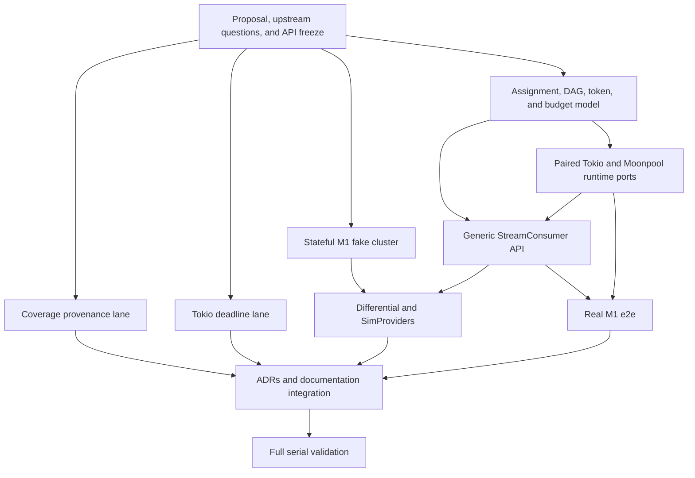

# M1-hardened scalable StreamConsumer and follow-up closure

- **Status**: In-flight
- **ADR**: [ADR-0098](../adr/0098-assignment-driven-m1-hardened-stream-consumer.md), preserving [ADR-0093](../adr/0093-pip-460-upstream-wire-surface.md)'s wire and negotiation decisions and [ADR-0095](../adr/0095-ignore-a-re-sent-scalable-layout-epoch.md)'s duplicate-layout handling
- **Date**: 2026-08-04
- **Owner**: Florentin Dubois
- **Scope**: One pull request closing `docs/follow-ups.md` sections 11, 12, 14, and 15
- **Broker baseline**: `apachepulsar/pulsar:5.0.0-M1` (`8dae0236c0a0d405ed7f8303081080520fe91551`)

## 0. Purpose

This proposal turns the PIP-460 layout observer into a message-delivering, assignment-driven `StreamConsumer`, fixes the API bound that currently makes that consumer uncallable, makes the sim-coverage verdict use current-pass artifacts, and removes the mixed-clock write-deadline flake.
The pull request remains one review unit, but its three lanes stay independently testable and revertible:

1. sim-coverage artifact provenance (follow-up 14);
2. Tokio write-deadline clock coherence (follow-up 15);
3. M1-hardened scalable consumption (follow-ups 11 and 12).

The scalable lane deliberately targets the wire Apache Pulsar 5.0.0-M1 ships while adopting client-side correctness improvements that need no newer wire fields.
It does not claim Pulsar `master` parity, PIP-486 bucket sharing, or GA wire stability.

## 1. Evidence and upstream boundary

### 1.1 Facts established from M1

The official Java V5 client treats scalable consumption as a control-plane assignment followed by an ordinary data plane:

- a DAG lookup discovers the controller and supplies the segment graph;
- `CommandScalableTopicSubscribe` registers a stable consumer identity;
- the controller returns full `ScalableConsumerAssignment` snapshots;
- each assigned `segment://` topic is consumed through an ordinary `Exclusive` consumer;
- all child consumers use the same subscription name;
- a child name is derived as `<consumer-name>-seg-<segment-id>`;
- receive, cumulative acknowledgement, transactions, batching, encryption, and close use ordinary Pulsar data-plane commands;
- one application-visible message ID carries a client-local position vector over segment-local message IDs;
- no total order exists between independent segments.

Changed assignments at the same `layout_epoch` are valid.
The epoch versions the segment layout, not consumer-group membership.
The subscribe response is the registration baseline; pushed assignments buffered before that response are replayed on top of it in wire receive order, and later pushes are applied in receive order within that controller connection.

The bundled M1 `bin/pulsar-client produce topic://...` command uses the public V5 producer.
Unkeyed messages are routed round-robin over active segments, making that command the authoritative black-box publisher for Magnetar's multi-segment e2e.

### 1.2 Upstream gaps

Four contracts remain unresolved in M1 and in the inspected Pulsar `master` snapshot:

| Contract                                                  | Upstream question                                                    | Interim Magnetar behavior                                                                                                                                                                                                                                          |
| --------------------------------------------------------- | -------------------------------------------------------------------- | ------------------------------------------------------------------------------------------------------------------------------------------------------------------------------------------------------------------------------------------------------------------ |
| Assignment ordering/fencing across controller connections | [apache/pulsar#26273](https://github.com/apache/pulsar/issues/26273) | Fence every callback and asynchronous result with a local controller-connection incarnation; accept changed equal-epoch assignments only in one incarnation's receive order; treat the replacement connection's validated response as its baseline                 |
| Logical unregister on a pooled controller connection      | [apache/pulsar#26272](https://github.com/apache/pulsar/issues/26272) | `close()` is locally definitive but cannot promise broker membership removal; the durable member may remain until the pooled connection closes                                                                                                                     |
| Full DAG parent-before-child ordering                     | [apache/pulsar#26274](https://github.com/apache/pulsar/issues/26274) | Keep the DAG watch; strict mode enforces the complete transitive barrier only where local ownership history proves every ancestor complete and blocks cross-member ancestry as unprovable, while explicit broker-managed mode makes no stronger cross-member claim |
| Controller subscribe through a proxy                      | [apache/pulsar#26275](https://github.com/apache/pulsar/issues/26275) | Published direct controller routing is validated; an absent M1 controller URL reuses only the already-authenticated direct bootstrap, while unrouteable published authority and proxy-any-broker registration fail closed                                          |

These questions stay tracked after this proposal ships; they are not silently treated as solved by local retries.

## 2. Decisions

### D1 - Keep the surface generic and owned

The public surface is schema/payload generic and engine generic:

```rust
pub struct StreamConsumer<S, E: Engine = TokioEngine> { /* private */ }
pub struct StreamMessage<S: Schema> { /* owns S::Owned; public accessors */ }
```

The runtime clients do not gain public `Clone` implementations.
Each runtime instead exposes an internal owned `SegmentSubscriber` capability backed by the narrow shared state needed to:

- route to the controller through the existing pool;
- open ordinary segment consumers through normal lookup and pool rules;
- allocate connection-local identifiers;
- retain provider-native task and time facilities;
- close logical resources without closing the public client.

This replaces the impossible `E::ClientState: Clone` method bound without introducing a lifetime on the public consumer or ambiguous driver ownership.
The builder accepts and retains an `Arc<S>` exactly as the existing typed-consumer facade does; a schema type parameter alone cannot supply broker metadata or decode state.
`StreamMessage<S>` owns `S::Owned` and does not require `S`, `S::Owned`, or either runtime client to implement `Clone`.

### D2 - Use an assignment-driven builder

The topic-only async constructor becomes a builder because a functional stream consumer needs a subscription and stable identity:

```rust
let consumer = client
    .scalable_stream_consumer(
        "topic://tenant/ns/topic",
        Arc::new(MySchema::new(/* schema configuration */)),
    )
    .subscription("subscription")
    .consumer_name("worker-a")
    .receiver_budget(ReceiverBudget::bytes(16 * 1024 * 1024)?)
    .ordering_mode(OrderingMode::Strict)
    .subscribe()
    .await?;
```

The wire `consumer_id` remains client-owned and is not ordinary user configuration.
Applicable ordinary consumer settings are frozen into a child template and applied consistently to every assigned segment.
M1 whole-segment ownership always creates `Exclusive` children; no subscription-type selector is exposed.

### D3 - Keep both controller assignment and DAG watch

Unlike the M1 Java client, the hardened consumer retains its DAG watch after discovering the controller.
The controller assignment grants ownership; the DAG supplies topology and ordering dependencies.
Neither substitutes for the other.

The builder exposes two explicit ordering modes:

- `OrderingMode::Strict`, the default, delivers a segment only when this consumer's retained ownership history proves every transitive ancestor complete;
- `OrderingMode::BrokerManaged`, an opt-in M1 compatibility mode, uses the same local barrier where proof exists but relies on the controller for ancestry owned by another group member and therefore promises no transitive parent-before-child order across members.

M1 may assign a sealed ancestor and its descendant to different group members while exposing no remote completion state.
In strict mode such an assignment enters observable `OrderingUnprovable` state and exposes no affected descendant; a later provable assignment may recover it.
Magnetar does not describe a broker-managed assignment as locally ordered.

An assignment may open a child early only when:

- the assignment belongs to the current controller incarnation;
- the segment exists in the validated DAG snapshot;
- its descriptor and attachment topic agree.

The child receives FLOW and exposes messages only when every required predecessor barrier permits delivery under the selected ordering mode.

### D4 - Serialize controller authority by local incarnation

Every controller connection receives a monotonically increasing local incarnation.
Assignment responses, pushed updates, reconnect tasks, child opens, close results, and delayed callbacks carry that incarnation.
No result from an older incarnation may mutate current state.

During registration or reconnect:

1. install the keyed session route before writing subscribe;
2. buffer pushed assignments received before the subscribe response;
3. validate and install the response as the registration baseline, even when a push frame arrived first;
4. replay buffered pushes on top of that baseline in their wire receive order;
5. discard exact duplicates;
6. apply changed equal-epoch snapshots in order;
7. reject lower epochs within one incarnation;
8. fail and resynchronize rather than accepting an epoch regression on a replacement connection.

Resynchronization marks reconnect intent before old-child teardown, waits for every confirmed child and in-flight child open to finish, then retries a rejected replacement registration on provider time while the aggregate remains live.
This prevents obsolete child-loop close results from recursively resynchronizing or racing a replacement baseline, and accommodates M1 retaining the old member until physical controller replacement.

This is local fencing, not a claim that M1 carries a distributed controller term.

### D5 - Replace the global destructive event stream internally

High-level scalable resources never compete on the client-global `VecDeque<ScalableEvent>`.
The runtimes route events by a typed key containing event family, session/consumer ID, and connection incarnation.

Each route owns bounded state and waiter registrations.
Waiters enroll before inspecting/draining state so `notify_waiters()` cannot strand a buffered event.
The driver clones a route under the registry lock, releases that lock, publishes under route state, then wakes tasks after releasing all locks.

The low-level raw API remains available only for sessions not claimed by an owned high-level route.
The same wire event is never delivered to both owners.

### D6 - Validate the complete DAG

The accepted DAG snapshot must satisfy:

- unique segment and placement IDs;
- no dangling or conflicting edges;
- acyclicity;
- reciprocal parent/child relationships where supplied;
- valid segment states and epochs;
- inclusive M1 hash ranges `[start, end]` within `0..=65535`, normalized without the current half-open `65536` sentinel;
- non-overlapping active leaves covering the configured key space;
- split children contained in and covering their parent range;
- merge children covering the union of all parents;
- bounded nodes, edges, ancestry depth, and serialized size;
- canonical attachment identity for every assigned segment, including agreement between the segment ID, inclusive hash-range name, descriptor, and `segment://` topic.

Snapshot application is atomic.
A malformed or incomplete replacement leaves no partially accepted graph and stops delivery fail-closed.

### D7 - Enforce a transitive parent-before-child barrier

An assigned segment may be attached early, but in strict mode it receives no flow and cannot expose messages until every locally retained transitive ancestor is complete and no required ancestor is unprovable.
For a merge, every parent branch must complete.
Sealed intermediate segments remain barriers rather than becoming immediately eligible.

A segment becomes complete only after:

- the ordinary child observes terminal/end-of-topic;
- every message already delivered to the application is resolved under the selected acknowledgement contract;
- every required acknowledgement operation settles;
- every transaction carrying a required acknowledgement commits with a confirmed outcome;
- no pre-terminal reservation remains.

Layout visibility, assignment arrival, seal state, timeout, or local queue emptiness alone never marks a barrier complete.
Unknown ancestry blocks delivery.
An acknowledgement merely accepted into a transaction does not complete a barrier; abort keeps the ancestor incomplete and permits redelivery.
Broker-managed mode applies this barrier to locally observed ancestry but makes no client-side completion claim for an ancestor owned by another member.

### D8 - Preserve only meaningful ordering guarantees

The consumer guarantees ordinary broker FIFO within each segment and the local DAG barrier between ancestors and descendants.
It does not define a total order between independent branches.
Fair selection is an implementation liveness property, not a cross-segment ordering promise.

With concurrent receives, dequeue/reservation order is linearized under consumer state, while future completion order is unspecified.
Callers requiring processing-order completion use one outstanding receive.

### D9 - Support concurrent receive without channels

`receive(&self)` and `receive_batch(&self, limits)` allow concurrent callers.
Each message is reserved exactly once.
Cancellation before reservation consumes nothing.
Cancellation after reservation either completes synchronously into an owned delivery or returns the same live authority to its original dequeue sequence before the future disappears.
Concurrent fencing that prevents restoration requests resynchronization rather than silently discarding the delivery.

A batch is reserved and removed atomically after its first-message wait; another receive cannot interleave inside the returned batch.
Per-waiter FIFO is not promised.

The implementation uses mutex-protected state plus waker slabs/`Notify` according to the existing no-channels rule.

### D10 - Use one aggregate receive budget

One aggregate budget bounds client-owned receive storage across all child queues, granted-but-unconsumed permits, aggregate reservations, encoded and decompressed payload buffers, batch/chunk reassembly, queue and ledger nodes, canonical-id/source sidecars, position-map nodes, DAG-barrier holding state, delivered-message leases, and retiring children.
Adding segments redistributes available capacity; it never multiplies the configured budget by segment count.

Every child runs in manual-FLOW mode: initial, automatic, reconnect, and refill FLOW are disabled, and only the aggregate arbiter grants permits.
Before granting one message permit, the arbiter reserves `MAX_FRAME_SIZE` (5 MiB); arrival transfers that reservation to exact retained bytes and releases any surplus.
Announced chunk totals and decompression output plus validation slack/workspace are reserved before retention or allocation, selected batch members use right-sized payload buffers, and a message that cannot fit produces `MessageTooLargeForBudget` without exposing partial data.
The configured budget must fit one maximum-size frame, five maximum-size stream-position values, three worst-case position-component node sets, two delivery-authority overheads, and a fixed 64 KiB control-plane cleanup reserve: `MAX_FRAME_SIZE + 5 * MAX_STREAM_POSITION_SIZE + 3 * MAX_POSITION_COMPONENTS * POSITION_COMPONENT_NODE_OVERHEAD + 2 * DELIVERY_AUTHORITY_OVERHEAD + 64 KiB = 13,697,152 bytes`.
Examples use 16 MiB; 8 MiB is below the valid minimum.

Moving a message between child, barrier, aggregate, and delivery state transfers one reservation rather than double-counting it.
The reservation lease remains until the delivery is resolved or dropped.
Budget exhaustion stops new flow or returns an explicit resource error; it never marks a predecessor drained.
Control-plane close and revocation use the separate fixed reserve so data pressure cannot prevent cleanup.

The byte guarantee covers allocations whose size Magnetar controls or can derive from the wire.
It cannot bound arbitrary additional memory allocated inside a user-defined `S::Owned` during schema decoding, and the public documentation states that boundary explicitly.

### D11 - Source-qualify every delivery

```rust
pub struct SegmentSource {
    pub segment_id: SegmentId,
    pub topic: String,
}

pub struct DeliveryToken { /* private, incarnation-bound */ }
pub struct PositionVector { /* private, versioned */ }
```

A delivery token binds the consumer instance, controller and child incarnations, segment identity, ordinary message ID, delivery epoch, and dequeue sequence.
Tokens from another consumer, an old seek/rebalance generation, or a retired source are rejected before wire I/O unless the source is deliberately retained for an unbounded drain.

The position vector records the highest position already delivered to the application for each segment at the delivery linearization point.
It is not an acknowledged cursor or a durable checkpoint by itself.
`DeliveryToken` is live authority and is never serializable; it can project a source-qualified `StreamMessageId` and `PositionVector` value.

### D12 - Support ack, nack, transactions, and transactional checkpoints

The public consumer provides:

- individual acknowledgement;
- cumulative position-vector acknowledgement;
- acknowledgement of a restored position vector;
- batch acknowledgement;
- negative acknowledgement with the configured/default delay;
- individual transactional acknowledgement;
- cumulative transactional position-vector acknowledgement.

Cumulative acknowledgement fans out to every represented segment, using segment-local cumulative semantics.
Partial failure is observable with confirmed and failed components; confirmed components cannot be rolled back, and retry is idempotent.

Transactional acknowledgement first single-flights registration of every represented `(segment topic, subscription)` with the transaction coordinator, then admits every segment component into that Pulsar transaction.
The client owns a per-transaction coordinator keyed by `TxnId`: acknowledgement admission increments its pending-operation count, commit atomically closes admission and waits for every admitted registration and acknowledgement, and abort closes admission before ending the transaction.
Commit cannot race an outstanding aggregate acknowledgement.
Any failed admitted registration or acknowledgement permanently poisons that transaction for commit: `commit_transaction` returns `TransactionPoisoned` without issuing `EndTxn(Commit)`, and only abort remains admissible.

Transactional acknowledgement means the broker accepted every segment component into the supplied Pulsar transaction, not that a cursor advanced.
The position becomes durable only after the caller successfully commits that transaction through `PulsarClient`.
The commit or abort outcome is propagated to every participating aggregate consumer.
Pending transactional acknowledgements use a sparse overlay for touched batch entries and do not advance reconnect cursors, release ordering barriers, or permanently consume batch/unacked state before confirmed commit.
Abort leaves cursors unchanged and permits redelivery; an unknown transaction outcome leaves each participant failed and resynchronization-required.
The consumer never labels a locally staged transaction position as committed before the commit result.
After settlement, owned propagation checkpoints each completed participant action so a cancellation retry cannot replay an already-issued FLOW prefix.
This is not the future `CheckpointConsumer` and does not make external non-Pulsar state atomic.

### D13 - Provide strict versioned serialization

`StreamMessageId` and `PositionVector` use a Magnetar-owned canonical binary envelope distinct from raw `MessageIdData`; `DeliveryToken` remains process-local and non-serializable.
Version 1 is fixed as:

1. four magic bytes `MSTR`;
2. one version byte `1`;
3. one kind byte (`1` for `StreamMessageId`, `2` for `PositionVector`);
4. two zero flag bytes;
5. one big-endian `u32` payload length;
6. the exactly sized payload, with every integer big-endian and every string/blob encoded as a big-endian `u32` byte length followed by bytes.

A `StreamMessageId` payload contains one `u64` segment ID, one UTF-8 canonical segment topic, and one canonical ordinary `MessageId` blob.
A `PositionVector` payload contains its originating `u64` layout epoch, then a `u32` component count followed by those same components in strictly increasing `(segment ID, topic bytes)` order.
The ordinary identifier blob must decode and re-encode byte-identically, preserving valid ledger, entry, partition, batch, and chunk fields without the obsolete in-memory scalable `MessageId::segment_id` extension.

Decoding rejects unknown versions, kinds, or flags; non-canonical ordering; duplicate entries; invalid segment/topic pairs; impossible ordinary message-ID fields; invalid UTF-8; more than 4096 components; a topic longer than 4096 bytes; an ordinary ID longer than 65536 bytes; an envelope larger than 1 MiB; length mismatches; and trailing data.
Deserialization restores a position value, not live authority.
Acknowledgement through a restored vector still requires validation against the current consumer, assignment, layout, and child generation.
Golden vectors, round-trip properties, rejection tests, and fuzz coverage land before this format is exposed.

### D14 - Make seek an aggregate state transition

Vector seek is limited on the M1 wire to currently owned, attached active leaves whose current layout epoch equals the epoch encoded in the vector; it cannot rewind a sealed or remote ancestor or cross a completed topology barrier.
It rejects with `ConcurrentSeek` while receive, batch, delivery, or transactional-ack reservations are active, and with `SeekAcrossLayoutUnsupported` when any component is not a current eligible leaf.
Starting seek increments the delivery epoch, clears buffered pre-seek state, invalidates old delivery tokens, applies ordinary seeks to every represented child, and preserves the already-established DAG barrier.
Every current eligible segment must be represented; an omitted segment is not silently interpreted as earliest or latest.

Seek failure leaves the consumer in an explicit failed/resync-required state rather than pretending the old position remains authoritative.

### D15 - Drain lost ownership without an unbounded buffer

When an assignment removes a segment:

1. stop new flow and new receive reservations;
2. fence receive completions from the old child generation;
3. retain the child as a draining acknowledgement target;
4. continue exposing only already reserved/delivered messages under the aggregate memory bound;
5. wait without a time limit for those deliveries and their acknowledgements to settle;
6. close the ordinary child;
7. permit a replacement open only after the old `Exclusive` child releases ownership.

The wait may be indefinite if the application never resolves a delivery.
It is observable through state/status logging.
Explicit aggregate close bypasses normal handoff progress, closes resources, and accepts ordinary at-least-once redelivery consequences.

Late open/close/ack results are committed only when their `(segment, generation, incarnation)` still matches current state.

A gained segment stays in assignment-owned `PendingOwnership` while another client or process retains the old `Exclusive` child.
Each ordinary lookup/subscribe attempt remains bounded by the normal operation deadline, but `ConsumerBusy` schedules another provider-timed attempt beyond any one operation deadline or ordinary retry count while the assignment remains current.
Assignment removal, controller-incarnation replacement, aggregate close, or a permanent error cancels and fences that loop.
Within one aggregate, replacement waits for the old generation's confirmation-bearing close; across clients, the new owner can observe only `ConsumerBusy` and eventual successful attach.

### D16 - Keep the Java-style pooled controller lifecycle honest

The controller connection uses the existing pool, matching the selected Java M1 model.
`close()` is locally definitive: it stops receive, reconnect, assignments, child activity, and local event routing and awaits child cleanup.

`StreamConsumer` itself is a cheap clone over shared aggregate state even though the public runtime clients remain non-`Clone`.
Explicit close through any clone globally fences the aggregate and awaits typed-route removal, reconnect-task termination, and child closes.
Dropping an intermediate clone does nothing.
Final-drop cleanup is synchronous and best-effort per ADR-0077: it marks the aggregate closed, advances generations, removes local routes and scalable registration state, wakes pending receivers and drivers, releases child guards so they stage ordinary closes, and never blocks or spawns.
Runtime tasks may not retain the final user close guard.

M1 has no scalable-consumer unregister command.
Closing the logical consumer therefore does not promise immediate or eventual broker membership removal while another pool user keeps the physical connection alive.
The API and documentation name this limitation explicitly, and [apache/pulsar#26272](https://github.com/apache/pulsar/issues/26272) remains open.

The implementation never repurposes `CommandScalableTopicClose`, ordinary `CommandCloseConsumer`, or `CommandUnsubscribe` as a controller unregister command.

### D17 - Fail closed on unsupported controller routing

The DAG session preserves both `controller_broker_url` and `controller_broker_url_tls`.
Direct mode selects the authority matching the bootstrap transport, validates every published controller and segment URL through the redirect allow-list before reusing credentials, and connects through supervised pooling.
Pulsar 5.0.0-M1 may omit the controller URL until leader election publishes one; in that precise case the official V5 client uses its configured service connection, so Magnetar reuses only its already-authenticated direct bootstrap.
Tokio and Moonpool retain the same TLS-capable supervised pool and reconnect rules for every published authority; neither guesses a missing segment target or downgrades transport.

Proxy-any-broker controller registration is not advertised as supported until [apache/pulsar#26275](https://github.com/apache/pulsar/issues/26275) establishes its contract and a real StreamConsumer proxy e2e passes.
The implementation does not send credentials or a subscribe command to an authority it cannot validate.

### D18 - Defer wire-dependent surfaces

The following remain out of scope:

- PIP-486 `bucket_ranges` and `Key_Shared` STICKY children;
- read fan-out beyond segment count;
- `QueueConsumer` and `CheckpointConsumer`;
- multi-topic scalable consumers;
- vector seek across a layout transition or into sealed/remote ancestry;
- a distributed assignment generation/controller term absent from M1;
- explicit scalable-consumer unregister absent from M1;
- GA wire compatibility and future proto bumps.

## 3. Public API sketch

```rust
pub struct StreamConsumerBuilder<'a, S: Schema, E: Engine = TokioEngine> { /* opaque */ }
pub struct StreamConsumer<S: Schema, E: Engine = TokioEngine> { /* opaque */ }
pub struct StreamMessage<S: Schema> { /* owns S::Owned */ }
pub struct StreamMessageId { /* opaque */ }
pub struct PositionVector { /* opaque */ }
pub struct DeliveryToken { /* opaque */ }
pub enum OrderingMode { Strict, BrokerManaged }

impl<S: Schema, E: Engine> StreamConsumer<S, E> {
    pub async fn receive(&self) -> Result<StreamMessage<S>, StreamConsumerError>;
    pub async fn receive_batch(
        &self,
        limits: BatchReceivePolicy,
    ) -> Result<Vec<StreamMessage<S>>, StreamConsumerError>;

    pub async fn acknowledge(
        &self,
        message: &StreamMessage<S>,
    ) -> Result<(), StreamConsumerError>;
    pub async fn acknowledge_cumulative(
        &self,
        message: &StreamMessage<S>,
    ) -> Result<(), StreamConsumerError>;
    pub async fn acknowledge_positions(
        &self,
        positions: &PositionVector,
    ) -> Result<(), StreamConsumerError>;
    pub async fn acknowledge_in_transaction(
        &self,
        message: &StreamMessage<S>,
        transaction: Transaction,
    ) -> Result<(), StreamConsumerError>;
    pub async fn acknowledge_cumulative_in_transaction(
        &self,
        message: &StreamMessage<S>,
        transaction: Transaction,
    ) -> Result<(), StreamConsumerError>;
    pub async fn acknowledge_positions_in_transaction(
        &self,
        positions: &PositionVector,
        transaction: Transaction,
    ) -> Result<(), StreamConsumerError>;
    pub fn negative_acknowledge(
        &self,
        message: &StreamMessage<S>,
    ) -> Result<(), StreamConsumerError>;

    pub fn delivered_position(&self) -> PositionVector;
    pub async fn seek_positions(
        &self,
        positions: &PositionVector,
    ) -> Result<(), StreamConsumerError>;
    pub async fn close(self) -> Result<(), StreamConsumerError>;
}
```

Exact names follow established crate conventions during implementation, but the ownership, concurrency, and semantic constraints above are binding for the proposal.

## 4. `magnetar-proto` state-machine work

The proto layer gains or changes:

- full assignment validation and normalized ordering;
- equal-epoch changed assignment support;
- connection-incarnation provenance on runtime-owned events;
- inclusive M1 hash-range normalization, canonical attachment validation, complete DAG validation, and topological eligibility helpers;
- strict locally provable ordering plus explicit broker-managed compatibility state;
- aggregate consumer/segment lifecycle generations;
- atomic single/batch delivery reservation primitives;
- delivery epoch and stale-token checks;
- manual-FLOW aggregate budget accounting and reservation hooks;
- position-vector component state;
- canonical stream-position serialization and validation;
- transaction admission and commit/abort outcome hooks;
- deterministic transition outputs for child open, flow, close, ack, seek, and terminal failure;
- local session removal without inventing a wire unregister command.

The proto crate remains free of I/O, Tokio, async traits, internal clocks, and panics.
Every user-driven time decision arrives through injected values.

## 5. Runtime ports

### 5.1 Tokio

Tokio implements:

- typed scalable route registry;
- enroll-before-drain waiters;
- owned internal `SegmentSubscriber`;
- plaintext/TLS controller route resolution through the existing scheme-aware pool and redirect allow-list;
- ordinary child open/ack/nack/seek/close delegation;
- manual child FLOW and aggregate budgeting;
- cancellation-safe concurrent receive and atomic batch reservation;
- connection-incarnation fencing;
- close and reconnect task cleanup.

### 5.2 Moonpool

Moonpool first extends its supervised pool and reconnect state to preserve plaintext/TLS authority, then mirrors the Tokio surface and behavior using provider-native task, network, and time facilities.
No ambient Tokio task or timer may enter a `SimProviders` path.
The two runtimes retain strict test-count parity.

## 6. Fakes and differential model

The fake environment becomes a stateful multi-endpoint cluster rather than a transcript echo:

- one controller endpoint;
- at least two segment endpoints;
- generated M1 frames only;
- full assignments, equal-epoch rebalances, duplicates, stale updates, and reconnect baselines;
- locally provable and cross-member-unprovable ancestry in both ordering modes;
- ordinary segment lookup, `Exclusive` subscribe, FLOW, message, ack, seek, termination, and close;
- delayed and failing open/ack/close operations;
- controller and child connection loss;
- observable routing destinations and resource counts.

The fake validates client commands and independent invariants; it never silently reroutes an invalid command or repeats the client's own state transition implementation.

Differential traces compare externally visible messages, segment provenance, position vectors, acknowledgement outcomes, barriers, assignments, resource counters, and terminal errors.
Runtime IDs, socket addresses, task scheduling order, and timestamps are normalized away.

## 7. Test plan

| Layer                | Crate                       | Required evidence                                                                                                                                                                                                                                                                                                                                                                                                                                                                                         |
| -------------------- | --------------------------- | --------------------------------------------------------------------------------------------------------------------------------------------------------------------------------------------------------------------------------------------------------------------------------------------------------------------------------------------------------------------------------------------------------------------------------------------------------------------------------------------------------- |
| Proto unit           | `magnetar-proto`            | Assignment normalization; inclusive hash ranges; equal/stale epochs; connection incarnations; malformed DAGs; strict and broker-managed ancestry; deep split and merge barriers; atomic receive/batch reservation; token and seek epochs; partial transaction failure poisoning and outcomes; budget conservation; serialization rejection; no-panic properties                                                                                                                                           |
| Tokio integration    | `magnetar-runtime-tokio`    | Real sockets; two consumers cannot steal events; push-before-response; segment fan-out; concurrent receive; batch atomicity; ack/nack/transaction/seek; unbounded drain and pending ownership; pooled-close limitation; plaintext/TLS direct controller routing                                                                                                                                                                                                                                           |
| Moonpool integration | `magnetar-runtime-moonpool` | Exact Tokio scenarios under provider-native execution plus deterministic race schedules and seed replay                                                                                                                                                                                                                                                                                                                                                                                                   |
| Differential         | `magnetar-differential`     | Equivalent normalized behavior for assignment, delivery, ordering barriers, acknowledgements, reconnect, close, and failures                                                                                                                                                                                                                                                                                                                                                                              |
| E2E                  | `magnetar-driver`           | Real M1 topic, official V5 CLI multi-segment publisher, public Magnetar builder, typed delivery, position-vector ack, transaction commit/abort, single-member split progression in Strict mode, explicit broker-managed multi-member behavior, close limitation, direct-bootstrap controller fallback when M1 omits its controller URL, and reachable broker-authored segment authority matching the standalone transport; broker-controlled assignment timing does not isolate client-side Strict gating |

Real e2e publishes distinct unkeyed messages with M1's bundled V5 client:

```text
bin/pulsar-client --url pulsar://localhost:6650 produce \
  --disable-batching \
  --messages segment-0,segment-1,segment-2,segment-3 \
  topic://public/default/e2e-scaled
```

Proxy controller registration is a negative capability test until the upstream contract is resolved.
The standalone fixture uses one reachable endpoint for bootstrap and controller registration, so it is not same-cluster multi-broker controller-routing evidence.

## 8. Follow-up 14 - current-pass sim coverage

The gate must not certify source from object files it did not establish as current-pass inputs.
An unconditional per-file missing-`SF:` rule is rejected because LLVM legitimately emits no record for functionless module/export/constant/bodyless-declaration files.

`run_sim_lcov` creates an invocation-owned empty coverage target outside the workspace's cached `target/`, sets `CARGO_LLVM_COV_TARGET_DIR` to that same absolute path for both execution and report, and removes it after every success or failure.
The final LCOV file remains `target/sim-coverage.lcov`, but no object or profile input comes from that cached root.
This avoids relying on package-scoped cleaning or a mutable cache action's pruning behavior as the integrity boundary.

Warm, cold, profile-only, object-only, and combined stale-artifact cases poison the default coverage target and prove it is never selected as an input.
Record-less files with no non-test function body remain advisory.
A record-less file with a non-test function body hard-fails even when a sibling file proves that its gated crate reached LCOV; a wholly record-less gated crate remains a hard failure.

## 9. Follow-up 15 - coherent Tokio write deadline

A deterministic paused-clock test must first force at least one write-future cancellation and reconstruction.
It observes the first write poll, advances near the original deadline, triggers a higher-priority arm, observes the reconstructed write poll, advances past the original deadline but not a fresh relative timeout, and requires `TimedOut` plus disconnection.

The production fix uses a write-local `tokio::time::Instant` and `tokio::time::timeout_at` while retaining one fixed deadline for the logical write.
Proto-facing `std::time::Instant` values remain unchanged, and Moonpool remains on its injected provider clock.
The 90-second harness margin is not widened.

ADR-0083's existing protocol-layer exemption remains applicable because this is a Tokio driver scheduling defect, not a state-machine behavior change.
The existing Moonpool deadline integration test, Tokio/Moonpool differential test, and keepalive-watchdog e2e remain the other-layer evidence; the implementation commit records that disposition rather than manufacturing an unrelated proto test.

## 10. Parallel implementation graph



### 10.1 Agent ownership

| Packet       | Exclusive file domain                                      | Output gate                                    |
| ------------ | ---------------------------------------------------------- | ---------------------------------------------- |
| Coverage     | `xtask/` and coverage-job cache configuration              | Poisoned target cannot influence fresh verdict |
| Deadline     | Tokio driver write deadline and existing deadline tests    | Deterministic red-before/green-after test      |
| Proto        | Scalable assignment/DAG/lifecycle state and proto tests    | Pure deterministic transition suite            |
| Fakes        | `magnetar-fakes` and differential broker model             | Self-tests against generated M1 frames         |
| Runtime pair | Both runtime clients/libs/drivers and paired runtime tests | Tokio/Moonpool semantic and count parity       |
| Facade       | `magnetar/src/scalable.rs` and engine adapters             | Generic API and concurrent-operation tests     |
| Differential | Differential tests and golden traces                       | User-visible trace parity                      |
| E2E          | Scalable M1 e2e only                                       | Public API proves real multi-segment delivery  |
| Integration  | ADRs, indexes, README, changelog, follow-ups               | Cross-document consistency and full validation |

Implementation agents work in isolated Worktrunk worktrees.
They may not push, open PRs, post issues, edit another packet's files, or edit shared documentation.
Every packet receives an explicit base SHA and returns changed paths, exact test commands/results, and unresolved risks.
An independent review agent checks each diff before local integration, with at most two repair cycles.

Only subscriptions explicitly marked usable for automation may supply external implementation agents.
Every credential request declares automated purpose and a descriptive job name.
Secrets never enter prompts, logs, files, Git configuration, or commits.

## 11. Commit plan

The one pull request keeps independently reviewable commits:

1. `docs(scalable): propose the M1-hardened stream consumer`
2. `fix(xtask): isolate sim coverage artifacts`
3. `fix(tokio): use runtime time for write deadlines`
4. `feat(scalable-topics)!: consume assigned segments generically`

The implementation commits carry their ADR, changelog, and affected documentation in the same commit.
The scalable commit adds a new ADR rather than rewriting accepted ADR-0093, and synchronizes the stale strict-epoch and half-open-range statements in the existing public documentation.
The scalable commit contains all required test layers and a `BREAKING CHANGE:` footer describing both the experimental facade and low-level proto impact.

Push and pull-request creation remain separately approval-gated.

## 12. Validation and acceptance

Each focused lane ran its targeted red/green checks before integration.
The code, fake, proto, runtime, façade, and differential focused suites passed.
The Moonpool runtime also passes a complete aggregate over simulated controller and segment sockets for four schedules derived from `MOONPOOL_SEED`, covering typed delivery from both sources, status, position, acknowledgement, and close under `SimProviders`.
The real M1 e2e target compiles and is discovered with `--features scalable-topics`, but Docker was unavailable on the integration host, so this branch did not execute it locally; the existing all-feature CI policy runs the ordinary e2e target when Docker is available.
A local worktree invocation of `check-runtime-test-parity` reported Tokio 407 / Moonpool 407 before the final committed-diff validation pass.
`check-sim-coverage` diffs `<merge-base>..HEAD`, not the uncommitted worktree.
The complete implementation diff must first be represented by `HEAD`, then the enforcing gate rerun before its result can satisfy this proposal's acceptance criteria.
The proposal therefore remains in flight until the real M1 target executes successfully, the committed complete diff passes the enforcing sim-coverage gate, and the required full validation chain is green.

The proposal is implemented only when:

- the public constructor resolves on both engines;
- two scalable consumers cannot steal events;
- changed equal-epoch assignments reconcile in one connection incarnation;
- old-incarnation callbacks cannot mutate current state;
- strict mode exposes no descendant before every locally provable ancestor completes and reports cross-member ancestry as unprovable;
- broker-managed mode is opt-in and documents its weaker cross-member ordering;
- aggregate controlled-memory/permit accounting stays within budget across topology growth;
- concurrent receive and batch cancellation lose no messages;
- ack, nack, seek, transaction, and serialization reject stale/foreign authority;
- a committed transactional vector advances all represented segment cursors and abort permits redelivery;
- Tokio and Moonpool produce equivalent public traces;
- real M1 e2e receives and acknowledges messages from multiple segments;
- `close()`'s possible broker-membership residue is tested and documented;
- sim coverage uses current-pass artifacts;
- the write deadline expires deterministically on Tokio virtual time.

## 13. Risks and rollback

The feature remains default-off and experimental. The safest rollback is to revert the scalable feature commit while retaining the independent coverage and deadline fixes.
No broker wire migration is introduced; the canonical stream-position envelope is the only new persisted Magnetar value.
Versioned position serialization must remain decodable once released; that format receives dedicated golden tests before the feature is declared implemented.

The largest accepted availability cost is the safety-first drain: an application that never resolves a delivered parent message can block descendant delivery and assignment handoff indefinitely while resources remain bounded.
The largest accepted upstream limitation is pooled logical close: local shutdown can leave durable broker membership until the physical controller connection closes.

Pulsar answers that require new wire fields become later vendor-proto work and never enter this PR as hand-maintained protocol projections.
